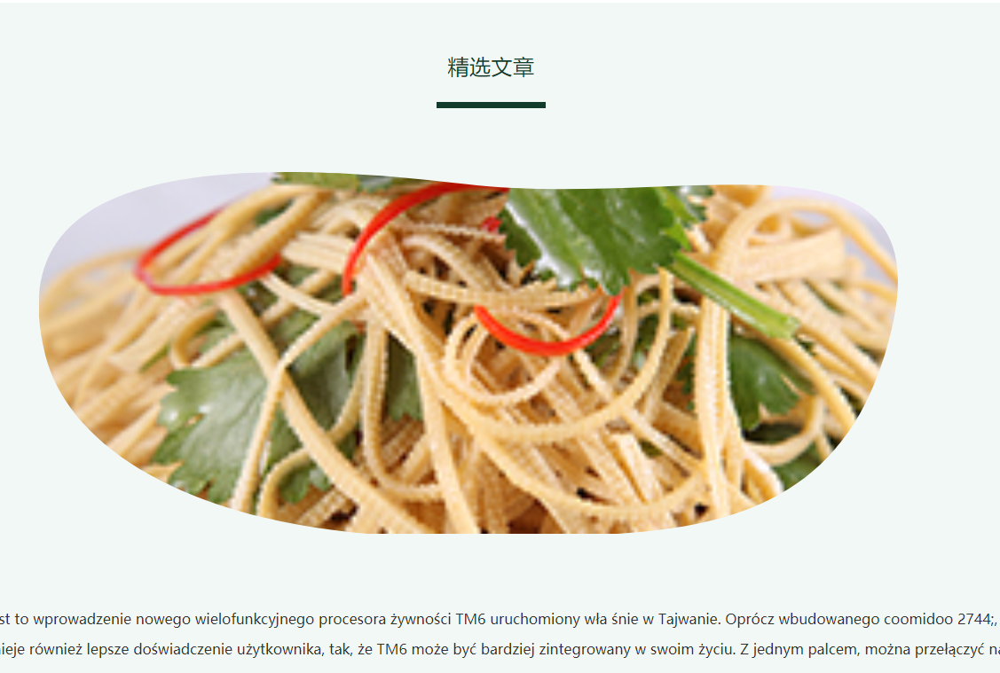

<!--
 * @Desc: ---   ----
 * @Date: 2019-12-23 11:47:00
 * @LastEditors: 王
 * @LastEditTime: 2020-04-28 17:59:52
 -->
## 巧妙使用flex布局实现手机自适应
Html布局代码，使用改布局即可解决在各移动设备的顶部Tab切换，下方需要无限加载布局。
PS:案例视图

<a data-fancybox title="xx" class="psimg" href="/images/css/ps01.jpg"></a>
``` html
  <view class="container">
    <view style="height:300rpx">固定在头部的标题</view>
     <scroll-view scroll-y>
       <view style="line-height:100rpx">啊啊啊啊啊</view>
       <view style="line-height:100rpx">啊啊啊啊啊</view>
       <view style="line-height:100rpx">啊啊啊啊啊</view>
       <view style="line-height:100rpx">啊啊啊啊啊</view>
       <view style="line-height:100rpx">啊啊啊啊啊</view>
       <view style="line-height:100rpx">啊啊啊啊啊</view>
       <view style="line-height:100rpx">啊啊啊啊啊</view>
       <view style="line-height:100rpx">啊啊啊啊啊</view>
       <view style="line-height:100rpx">啊啊啊啊啊</view>
       <view style="line-height:100rpx">啊啊啊啊啊</view>
       <view style="line-height:100rpx">啊啊啊啊啊</view>
       <view style="line-height:100rpx">啊啊啊啊啊</view>
     </scroll-view>
</view>
```
 CSS布局
``` css
    page{ 
      height: 100%; 
    }
    .container{ 
      display: flex;
      flex-direction: column;
      height: 100vh; 
    }
    scroll-view{ 
      flex: 1;
      height: 1px;
      background: #ccc 
    }
```

## css多行显示...

````css
	overflow: hidden;
	display: -webkit-box;
	text-overflow: ellipsis;
	-webkit-line-clamp: 2; /* 2 表示两行出现。。。 ，这个是行数*/
	-webkit-box-orient: vertical;

````

## 文本单行显示溢出时出现省略号
```css
  white-space: nowrap;
  overflow: hidden;
  text-overflow: ellipsis;
```

## 文本首行缩进两字符
```css
  text-indent: 2em;
```

## 文字中间划线
```css
  text-decoration: line-through;
```

## 设置文本首字母样式，常用于显示价格

```html
  <text class="price">￥101.00</text>

  .price {
		font-size: 24rpx;
		color: #333333;
		&::first-letter {
			font-size: 50rpx;
			color: #e74c3c;
		}
	}
```

## 设置空格的宽度

```html
  <text class="space">我有 空 格</text>

  .space {
		word-spacing: 30rpx;
	}
```

## 多个元素水平自动排列，自动换行，每行元素两边对齐

```html
<template>
  <view class="container">
    <view class="content">
      <view class="item" v-for="(item, index) in 10" :key="index">
        <text>{{ item }}</text>
      </view>
    </view>
  </view>
</template>

  
<style lang="scss" scoped>
	.container {
		width: 100vw;
		padding: 24rpx;
		box-sizing: border-box;
		background: #808080;
		
		.content {
			width: 100%;
			background: #FFFFFF;
			display: flex;
			flex-wrap: wrap;
			
			.item {
				width: 150rpx;
				height: 150rpx;
				border-radius: 20rpx;
				background: #3498db;
				margin-bottom: 20rpx;
				//  calc((父元素宽度 - 子元素宽度*每行子元素个数) / 每行的间距个数)
				margin-right: calc((100% - 600rpx) / 3);
        // 选中每行的最后一个元素不设置margin-right
				&:nth-of-type(4n) {
					margin-right: 0;
				}
			}
		}
	}
</style>

```

## css实现不规则图形

html部分

````html
 
                                            <svg height="0" width="0">
                                                <defs>
                                                  <clipPath id="svgPath2">
                                                    <path fill-rule="evenodd"  fill="rgb(9, 193, 95)"
 d="M33.248,4.410 C76.206,-3.904 202.375,2.518 262.630,4.410 C322.884,6.303 349.931,159.282 292.091,187.494 C234.252,215.706 117.286,205.364 72.181,202.225 C27.074,199.087 1.884,172.627 0.630,113.840 C-0.624,55.053 -1.097,11.058 33.248,4.410 Z"/>
                                                  </clipPath>
                                                </defs>
                                              </svg>
````

css部分

````css
 img {
    width: 100%;
    height: 100%;
    -webkit-clip-path: url(#svgPath2);  
    clip-path: url(#svgPath2);
}
````


参考网站：https://www.jianshu.com/p/4292c89a7576


