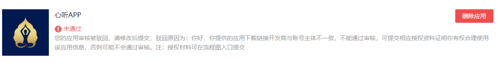

<!--
 * @Desc: ---   ----
 * @Date: 2019-12-23 10:25:25
 * @LastEditors: 刘
 * @LastEditTime: 2020-05-29 19:51:57
 -->
##  emijo代码格式
#### 代码格式请自行复制，提交问题请再问提前加上格式，需要某类问题可直接搜索表情
### 已解决 :smile:  未解决 :sob:  希望解决 :blush:

## :smile: 1.如何实现自动化推送
找到项目根目录deploy.sh双击打开等待完成之后即可。使用之前确保git本地与仓库都是最新状态。
## :smile: 2.本项目中如何在页面加入图片（可点击放大）
使用代码如下即可实现,将路径替换至对应图片
``` html
<a data-fancybox title="xx" class="psimg" href="/images/css/ps01.jpg"></a>
```
## :smile: 3.VUE 中如何初始化ActiveXObject对象
``` js
const { ActiveXObject } = window
this.myObject = new ActiveXObject('myActiveX.PcscActiveX') || null
````

## :sob: 4.未解决uni-app中转换arraybuffer中文乱码问题

## :smile:5.未解决IOS审核遇到以下问题

####  :smile:1). app包含第三方登录时，必须有苹果账户登录

> 利用接口控制第三方登录的显示隐藏

#### :smile: 2).提交的商品包含有非iOS设备信息

> 营销图中不能包含价格相关和手机边框不能是非IOS手机

#### :smile:3).如果是维修类型软件需要说明不是原厂配件，维修后保修期失效

## :smile: 6.解决UNIAPP中使用uni-popup组件在APP中有时会不弹的问题
#### :smile:在这个组件目录中修改
<br/>

```javascript
open() {
    this.showPopup = true
    // #ifdef APP-PLUS
    this.showTrans = true
    // #endif
    // #ifndef APP-PLUS
    // 在app中不使用延迟
    this.$nextTick(() => {
        setTimeout(() => {
            this.showTrans = true
        }, 50);
    })
    // #endif
    // this.$nextTick(() => {
    // 	setTimeout(() => {
    // 		this.showTrans = true
    // 	}, 50);
    // })
    this.$emit('change', {
        show: true
    })
},
close(type) {
    this.showTrans = false
    // #ifdef APP-PLUS
    this.$emit('change', {
        show: false
    })
    this.showPopup = false
    // #endif
    // #ifndef APP-PLUS
    // 在app中不使用延迟
    this.$nextTick(() => {
        clearTimeout(this.timer)
        this.timer = setTimeout(() => {
            this.$emit('change', {
                show: false
            })
            this.showPopup = false
        }, 300)
    })
    // #endif
    // this.$nextTick(() => {
    // 	clearTimeout(this.timer)
    // 	this.timer = setTimeout(() => {
    // 		this.$emit('change', {
    // 			show: false
    // 		})
    // 		this.showPopup = false
    // 	}, 300)
    // })
},
```

## :smile: 7.解决微信开放平台分享申请失败的一种情况的解决办法
#### :被驳回原因：
<br/>

#### :解决方法：[微信开放社区](https://developers.weixin.qq.com/community/develop/doc/00082460f449a8c77f4a4bad75ac00?jumpto=reply&parent_commentid=000c44b92dc0b84a724a92d7f518&commentid=000ae2ac22ce70c18e4ae19d65b0)
<br/>

## :smile: 8.苹果开发者资质类型从个人转为组织

流程文档[查看](http://39.99.37.143:3000/liuzhen/iOS_Dev.git)