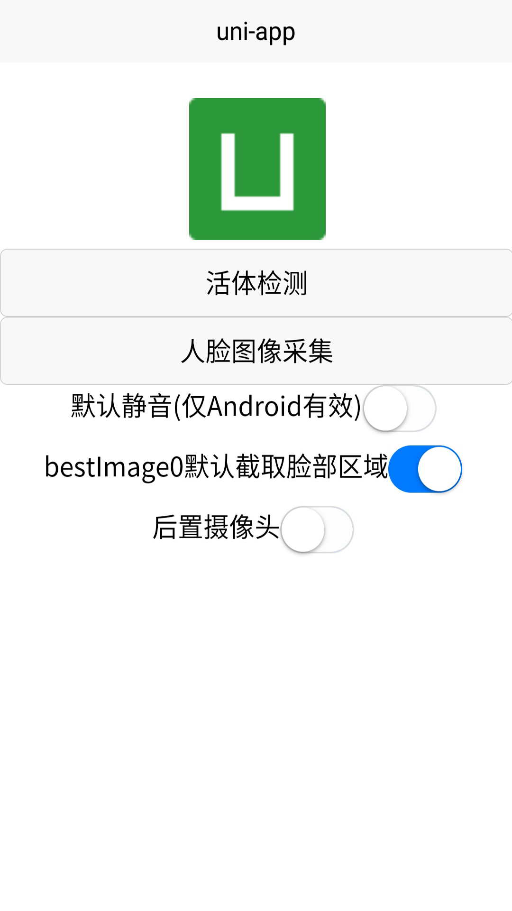
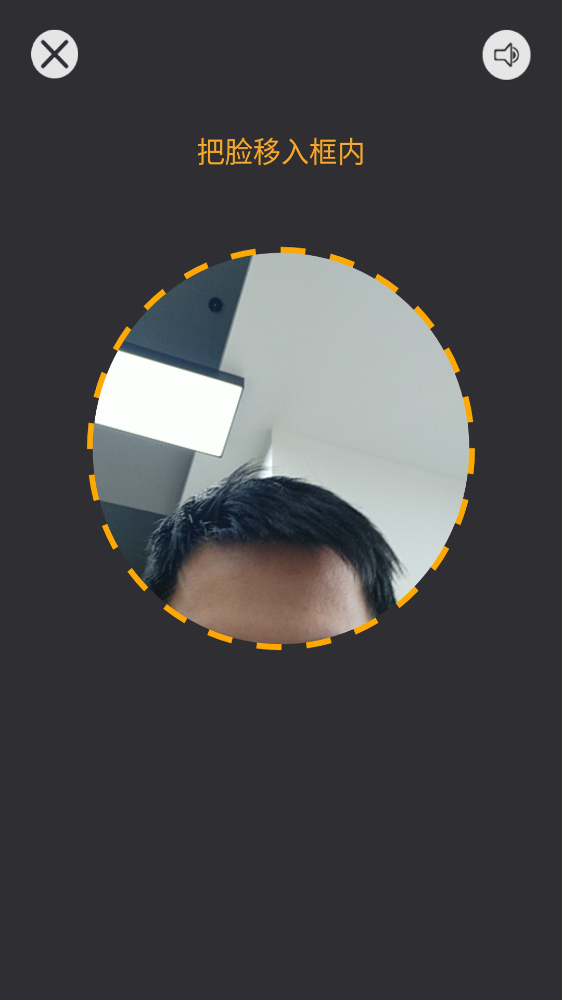
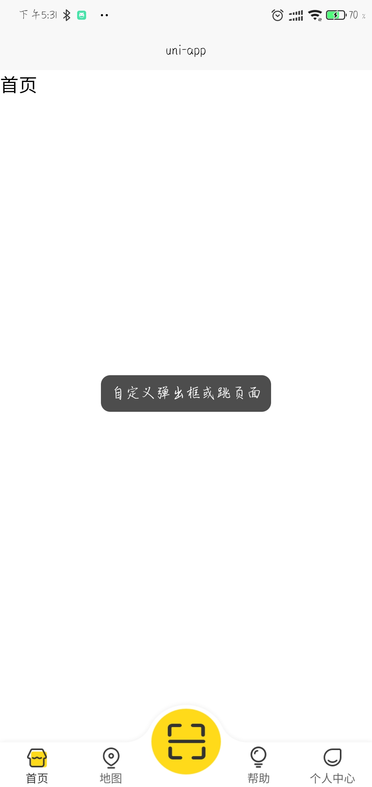
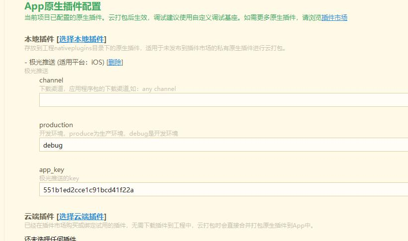

<!--
 * @Desc: ---   ----
 * @Date: 2019-12-23 11:47:00
 * @LastEditors: 刘
 * @LastEditTime: 2020-06-11 10:29:37
 -->

## 隐藏式状态栏

::: tip 思路解析
利用页面滚动事件,背景色的透明度动态改变透明度实现。
:::

### HTML 结构

```html
<view
  class="gradual-header"
  :style="'background: rgba(45,168,150,' + diaphaneity + ')'"
>
  <view class="status_bar"></view>
  <view class="page-header"
    ><view class="title">{{diaphaneity>0?'首页':''}}</view></view
  >
</view>
```

### css 样式

```css
.gradual-header {
  position: fixed;
  top: 0;
  left: 0;
  right: 0;
  z-index: 100;
}
.status_bar {
  height: var(--status-bar-height);
  width: 100%;
}
```

### JS 部分

```javascript
export default {
  data () {
    return {
      diaphaneity: 0
    }
  },
  onLoad () {},
  methods: {},
  // 渐变状态栏
  // 页面混动事件
  onPageScroll (e) {
    this.diaphaneity = e.scrollTop / 100
  }
}
```

## 数据状态组件(uni-app)

### 示例


组件名：uni-steps

[组件下载地址](https://files.cnblogs.com/files/baobao0205/uni-steps.rar)

### 使用方式

- 在 script 中引用组件

```javascript
import uniSteps from '@/components/uni-steps/uni-steps.vue'
export default {
  components: { uniSteps }
}
```

- 在 template 中的使用

```html
<uni-steps
  :options="options"
  :success-icon="successimg"
  :error-icon="errorimg"
></uni-steps>
```

- 属性说明
  属性名 | 类型 | 默认值 | 说明
  -|-|-|-
  options | Array| | 格式为：[{title:'xxx',state:'1'},{title:'xxx',state:'0'}] title: 显示内容 state: 状态 1 成功 0 失败
  successIcon | String| | 状态为'1'时显示的图标
  errorIcon | String| | 状态为'0'时显示的图标
  rowColor | String | #3D97FF| 图标下竖线的颜色
  borderColor | String | #c8c7cc| 显示内容下横线的颜色

## 常见商城滚动分类

### 示例


组件名 cg-swiper

[组件下载地址](https://github.com/ChamHuang/web/blob/master/uniapp/cg-swiper.vue)

### 使用方式

- 在 script 中引入

```js
import cgSwiper from '@/components/cg-swiper.vue'
export default {
  components: { cgSwiper }
}
```

- 在 template 中的使用

```html
<cg-swiper
  :swiperList="channelCategoryList"
  @clickItem="handleCategory"
  swiperActiveColor="#3D97FF"
></cg-swiper>
```

- 属性说明
  属性名 | 类型 | 默认值 | 说明
  -|:-:|:-:|-
  swiperDots | Boolean| false |
  swiperColor | String| #999999 | 指示点颜色
  swiperActiveColor | String| #FFCC00 | 选中指示点颜色
  autoplay | Boolean | false| 是否自动切换
  interval | Number | 5000 | 自动切换时长
  duration | Number | 500 | 滑动动画时长  
  circular | Boolean | false | 是否衔接滑动
  swiperList | Array | [] | 数据
  customize | Boolean | true | 是否开启自定义指示点
  number | Number | 8 | 一屏显示的数量
- 方法说明
  methods | 说明
  -|-
  handleCategory | 接收参数 item 处理点击事件
  clickItem | 子组件向父组件传值的事件名

## 常见分类分段器

### 示例


组件名 ui-tags

[组件下载地址](https://github.com/ChamHuang/web/blob/master/uniapp/ui-tags.vue)

### 使用方式

- 在 script 中引入

```js
import uiTags from '@/components/ui-tags.vue'
export default {
  components: { uiTags }
}
```

- 在 template 中的使用

```html
<ui-tags :current="current" :values="list" @clickItem="onClickItem"></ui-tags>
```

- 属性说明
  属性名 | 类型 | 默认值 | 说明
  -|:-:|:-:|-
  values | Array| [] | 数组格式为 [{name: '全部', name: '其他'}]
  current | Number| 0 | 当前选中的值
- 方法说明
  方法名 | 类型 | 说明
  -|:-:|-
  onClickItem | Fun | 向父组件传递两个值（currentIndex 为当前的索引,currentItem 为当前的对象）
  clickItem | Fun | 监听父组件事件名

  ## 自定义 navbar

### 示例


组件名 navbar

[组件下载地址](https://github.com/ChamHuang/web/blob/master/uniapp/navbar.vue)

### 使用方式

- 在 script 中引入

```js
import navbar from '@/components/navbar.vue'
export default {
  components: { navbar }
}
```

- 在 template 中的使用

```html
<navbar
  :title="i18n.title1"
  :languageFlag="true"
  @handleSelectLanuage="handleSelectLanuage"
  icon="../../static/img/icon-search.png"
></navbar>
```

- 属性说明
  属性名 | 类型 | 默认值 | 说明
  -|:-:|:-:|-
  inputFlag | Boolean| false | 是否显示 input 输入框
  disabled | Boolean| false | 是否禁用输入框
  backFlag | Boolean| false | 是否显示返回图标
  title | String| '商城' | navbar 标题
  icon | String| '' | languageFlag 为 true 时 icon 显示的图标
  languageFlag | Boolean| false | 是否显示右侧图标 _可以进行优化_
  languageFlag | Boolean| false | 是否显示右侧图标
  edit | String| '完成' | confirmFlag 为 true 右侧显示文字
  confirmFlag | Boolean| false | 是否显示右侧文字
- 方法说明
  方法名 | 类型 | 说明
  -|:-:|-
  handleBack | Fun | 监听返回事件
  handleSelectLanuage | Fun | 监听右上角图片事件
  handleEdit | Fun | 监听右上角文字事件
  handleSearch | Fun | 监听搜索按钮

## 自定义 ui-cell

### 示例


组件名 uiCell

[组件下载地址](https://github.com/ChamHuang/web/blob/master/uniapp/ui-cell.vue)

### 使用方式

- 在 script 中引入

```js
import uiCell from '@/components/ui-cell.vue'
export default {
  components: { uiCell }
}
```

- 在 template 中的使用

```html
<ui-cell
  :title="i18n.totalXpense"
  :arrow="false"
  :right="'￥' + list.cost"
></ui-cell>
```

- 属性说明
  属性名 | 类型 | 默认值 | 说明
  -|:-:|:-:|-
  padding | Boolean| false | 是否使用 app-container 类名
  arrow | Boolean| true | 默认是否显示箭头
  right | String| null | 右侧显示的文字内容
  title | String| '标题' | 左侧显示标题内容
  del | Boolean| false | 是否显示删除图标
  obj | Object| null | 删除需要传的对象
- 方法说明
  方法名 | 类型 | 说明
  -|:-:|-
  handleClick | Fun | 监听点击事件
  handleDel | Fun | 监听删除事件 向父组件传 obj 对象

## 可滑动 Navbar

- template

  ```html
  <template>
    <view class="container">
      <!-- navbar -->
      <view class="navbar">
        <view
          v-for="(item, index) in navList"
          :key="index"
          class="nav-item"
          :class="{current: tabCurrentIndex === index}"
          @click="tabClick(index)"
        >
          {{item.text}}
        </view>
      </view>

      <!-- 列表 -->
      <swiper
        :current="tabCurrentIndex"
        class="swiper-box"
        duration="300"
        @change="changeTab"
      >
        <swiper-item
          class="tab-content"
          v-for="(tabItem,tabIndex) in navList"
          :key="tabIndex"
        >
          <scroll-view
            class="list-scroll-content"
            scroll-y
            @scrolltolower="getList"
            :scroll-with-animation="true"
          >
            <view
              class="list"
              v-for="(item, index) in tabItem.orderList"
              :key="index"
            >
              {{item.deviceNo}}
            </view>
            <view class="no-data" v-if="tabItem.orderList.length === 0">
              <text>暂无数据</text>
            </view>
          </scroll-view>
        </swiper-item>
      </swiper>
    </view>
  </template>
  ```

* script

  ```javascript
  <script>
  	// import Json from '@/Json';
  	export default {

  		data() {
  			return {
  				navList: [{
  						state: 0,
  						text: '蓝牙设备',
  						loadingType: 'more',
  						orderList: [{
  								deviceNo: '8745995123',
  								time: '2020-02-12',
  								address: '郑州市高新区大学科技园',
  								isLine: '在线'
  							},
  							{
  								deviceNo: '8745995123',
  								time: '2020-02-12',
  								address: '郑州市高新区大学科技园',
  								isLine: '在线'
  							},
  							{
  								deviceNo: '8745995123',
  								time: '2020-02-12',
  								address: '郑州市高新区大学科技园',
  								isLine: '在线'
  							},
  							{
  								deviceNo: '8745995123',
  								time: '2020-02-12',
  								address: '郑州市高新区大学科技园',
  								isLine: '在线'
  							},
  							{
  								deviceNo: '8745995123',
  								time: '2020-02-12',
  								address: '郑州市高新区大学科技园',
  								isLine: '在线'
  							},
  							{
  								deviceNo: '8745995123',
  								time: '2020-02-12',
  								address: '郑州市高新区大学科技园',
  								isLine: '在线'
  							},
  							{
  								deviceNo: '8745995123',
  								time: '2020-02-12',
  								address: '郑州市高新区大学科技园',
  								isLine: '在线'
  							},
  							{
  								deviceNo: '8745995123',
  								time: '2020-02-12',
  								address: '郑州市高新区大学科技园',
  								isLine: '在线'
  							},
  							{
  								deviceNo: '8745995123',
  								time: '2020-02-12',
  								address: '郑州市高新区大学科技园',
  								isLine: '在线'
  							},
  							{
  								deviceNo: '8745995123',
  								time: '2020-02-12',
  								address: '郑州市高新区大学科技园',
  								isLine: '在线'
  							}
  						]
  					},
  					{
  						state: 1,
  						text: 'WiFi配网',
  						loadingType: 'more',
  						orderList: [

  						]
  					},
  					{
  						state: 2,
  						text: '远程控制',
  						loadingType: 'more',
  						orderList: [

  						]
  					},
  					{
  						state: 1,
  						text: 'WiFi配网',
  						loadingType: 'more',
  						orderList: [

  						]
  					}
  				],
  				tabCurrentIndex: 0,
  			};
  		},
  		onLoad(option) {
  			this.getList()
  		},
  		methods: {
  			// 获取数据
  			getList() {
  				console.log(12)
  				// let equipList = Json.equipList
  				// this.navList[this.tabCurrentIndex].orderList = equipList
  			},

  			// narbar改变
  			changeTab(e) {
  				this.tabCurrentIndex = e.target.current;
  				if (this.tabCurrentIndex === 1) {} else if (this.tabCurrentIndex === 0) {}
  			},

  			// 点击navbar
  			tabClick(i) {
  				console.log(i)
  				this.tabCurrentIndex = i
  			}

  		}

  	}
  </script>
  ```

- style

  ```less
  .container {
    height: 100vh;
    display: flex;
    flex-direction: column;

    .swiper-box {
      flex: 1;
      overflow: auto;

      .tab-content {
        height: 100%;
        overflow-y: auto;
      }
    }

    .no-data {
      margin-top: 195rpx;
      width: 100%;
      display: flex;
      flex-direction: column;
      align-items: center;

      image {
        width: 354rpx;
        height: 262rpx;
      }

      text {
        margin-top: 56rpx;
        font-size: 32rpx;
        color: #999999;
      }
    }
  }

  .navbar {
    display: flex;
    height: 40px;
    padding: 0 5px;
    background: #fff;
    margin-bottom: 10rpx;
    position: relative;
    z-index: 10;
    .nav-item {
      flex: 1;
      display: flex;
      justify-content: center;
      align-items: center;
      height: 100%;
      font-size: 15px;
      position: relative;

      &.current {
        &:after {
          content: '';
          position: absolute;
          left: 50%;
          bottom: 0;
          transform: translateX(-50%);
          width: 96rpx;
          height: 0;
          border-bottom: 2rpx solid #f5432d;
        }
      }
    }
  }

  .list {
    position: relative;
    width: 684rpx;
    height: 154rpx;
    box-shadow: 0rpx 6rpx 17rpx 3rpx rgba(214, 213, 212, 0.28);
    border-radius: 6rpx;
    margin: auto;
    margin-bottom: 23rpx;
    display: flex;

    .priceImg {
      width: 178rpx;
      height: 154rpx;
      background-size: 178rpx 154rpx;
      font-size: 55rpx;
      font-family: DIN;
      text-align: center;
      line-height: 154rpx;
      font-weight: 500;
      color: rgba(255, 255, 255, 1);

      text {
        font-size: 20rpx;
      }
    }

    .right {
      margin-left: 30rpx;
      display: flex;
      flex-direction: column;

      .line {
        display: inline-block;
        width: 327rpx;
        border-bottom: 1rpx dashed #e4e4e3;
      }
    }

    .l-btn {
      height: 154rpx;
      flex: 1;
      display: flex;
      justify-content: center;
      align-items: center;
      position: relative;

      text {
        display: inline-block;
        width: 138rpx;
        height: 40rpx;
        background: #f5432d;
        box-shadow: 0 3rpx 7rpx 0 #f5432d;
        border-radius: 20px;
        text-align: center;
        line-height: 40rpx;
        font-size: 24rpx;
        color: #fdfdfd;
      }

      image {
        position: absolute;
        right: 0;
        top: 25rpx;
        width: 104rpx;
        height: 104rpx;
      }
    }
  }
  ```

## 订单列表页 Demo（Tabs+滑块）

- 包含滑动切换，滑块跟组，数据缓存，上拉加载。
- 数据使用 Mock 数据，Git 附件 Server 可见
- Tabs 单独组件，可单独使用

### 示例


### 地址

- Tabs 组件地址: **/pages/index**
- Server 为 Mock 数据服务,需要安装依赖
  
  > Mock 服务使用

```javascript
  npm install
  npm run dev
```

- 演示 Demo
  
  > 滑动列表 Demo 放入 HX 运行

Git 地址:[点击进入](http://39.99.37.143:3000/wangbowen/Tabs.git)

### Tabs 参数

| 属性名      |   类型   | 默认值  | 说明           |
| ----------- | :------: | :-----: | -------------- |
| tabs        | string[] |
| tabhight    |  Number  |    0    | Tabs 高度      |
| background  |  String  | #ffffff | 背景颜色       |
| lineWidth   |  Number  |   20    | 滑块宽度       |
| lineHeight  |  Number  |    4    | 滑块高度       |
| activeColor |  String  | #fc4a18 | 选中颜色       |
| normorColor |  String  | #333333 | 字体未选中颜色 |
| active      |  Number  |    0    | 默认选中       |

### Tabs 方法

change : active 改变时触发

## 瀑布流 Demo

- 动态计算数据，完美展示。

### 示例


### 地址

- Tabs 组件地址: **/components/**

- 演示 Demo
  
  > 直接拉入 HX 运行

Git 地址:[点击进入](http://39.99.37.143:3000/wangbowen/waterfallFlow.git)

### Tabs 参数

| 属性名 | 类型  | 默认值 | 说明           |
| ------ | :---: | :----: | -------------- |
| list   | any[] |   []   | 需要展示的数组 |

## uniapp中下拉框组件使用

- uniapp插件市场中下拉框组件的使用

### 地址

- Tabs 组件地址: **/components/**


地址:[点击进入](https://ext.dcloud.net.cn/plugin?id=518)

### Tabs 参数

|       参数        |           说明                                   |     类型         |     可选值     |              默认值    |
|      ------       |     :---:                                        |       :----:    |    :----:     |         -------------- |
|  list	            |  要展示的数据	                                     |    Array	      |      —        |	        [ ]           |
|  clearable      	|  是否显示清除按钮	                                 |     Boolean    |       —       |	        true            |
|  initValue	      |  第一次显示时默认选中的文本	                       |     String	     |        —      |	        " "               |
|  isCanInput	      |  是否可以输入值	                                  |     Boolean	    |        —	    |       false             |
|  placeholder	    |  占位符	                                         |     String	      |       —	     |         "请选择"          |
|  style_Container	|  组件根节点的行内样式	                            |     String	     |        —      |	        " "              |
|  disabled	        |  是否禁用整个选择框	                              |     Boolean	     |      —        |	        false            |
|  showItemNum    	|  显示列表的窗口高度，数字表示能显示几个列表项	      |   Number	       |       —       |         	5               |
|  listShow	        |  第一次显示时是否显示列表                        	|   Boolean	       |       —	      |         false             |
|  focusShowList    |	 当input获取焦点时，是否自动弹出列表框           	 |     Boolean	    |    —           |	    null，表示在pc上自动弹出，在移动端(包括模拟环境)不弹|
|  selectHideType	  |  本选择框的显示与其它选择框显示之间的关系	         |     String	       |    'independent' - 是独立的，与其它选择框互不影响<br>'hideAll' - 任何一个选择框展开时，隐藏所有其它选择框<br>'hideOthers'- 当本选择框展开时，隐藏其它的选择框。 当其它选择框展开时，不隐藏本选择框。<br>'hideSelf' - 当本选择框展开时，不隐藏其它的选择框。当其它选择框展开时，隐藏本选择框。	|"hideAll"|


### 使用方法

```javascript
<templete>
    <view style="width: 80%; margin: auto; margin-bottom: 20px;">
        <xfl-select 
            :list="list"
            :clearable="false"
            :showItemNum="5" 
            :listShow="true"
            :isCanInput="true"  
            :style_Container="'height: 50px; font-size: 16px;'"
            :placeholder = "'placeholder'"
            :initValue="'苹果'"
            :selectHideType="'hideAll'"
        >
        </xfl-select>
    </view>
</templete>


import xflSelect from '../../components/xfl-select/xfl-select.vue';     //导入

export default {
    data() {
        return {
            list: [       //要展示的数据
                '苹果',
                {value: '香蕉', disabled: true},
                '葡萄',
                '芒果',
                '大白菜',
            ],
        }
    },
    components: { xflSelect },  //注册为子组件

    /* 
        // 或者在 main.js 中注册为全局组件 
        import xflSelect from './components/xfl-select/xfl-select.vue';
        Vue.component('xfl-select', xflSelect);
    */
}
```

## uni-app 生成含有二维码的海报并下载保存到本地

[组件下载地址](https://github.com/q310550690/uni-app-qrcode)

```html
  <template>
    <view class="post">
        <tki-qrcode class="qrcode" cid="qrcode" ref="qrcode" :val="val" :size="size" :onval="onval" :loadMake="loadMake" :usingComponents="true" @result="qrR" :show="false" >
        <view class="wrapper"><canvas style="height: 100%;width: 100%;backgroundColor: #FFFFFF" canvas-id="firstCanvas"></canvas></view>
    </view>
  </template>
```
* script
  ```javascript
      <script>
      import tkiQrcode from '@/components/tki-qrcode/tki-qrcode.vue'
      export default {
      data() {
        return {
          canvasShow: false,
          picurl:'',
          val: '', // 要生成的二维码值
          size: 325, // 二维码大小
          unit: 'upx', // 单位
          background: '#b4e9e2', // 背景色
          foreground: '#309286', // 前景色
          pdground: '#32dbc6', // 角标色
          icon: '', // 二维码图标
          iconsize: 40, // 二维码图标大小
          lv: 3, // 二维码容错级别 ， 一般不用设置，默认就行
          onval: false, // val值变化时自动重新生成二维码
          loadMake: true, // 组件加载完成后自动生成二维码
          src: '', // 二维码生成后的图片地址或base64
          cover:'static/share_bg.png'
        }
      },
      onLoad:function(option){
        var thas=this
        thas.val=option.devicenumber
      },
      methods: {
        qrR(path) {
          let that = this;
          this.qr_path = path;
          let system_info = uni.getSystemInfoSync();
          let ctx = uni.createCanvasContext('firstCanvas');
          console.log(res.path);
          ctx.drawImage(res.path, 0, 0, uni.upx2px(750), uni.upx2px(1330));
          ctx.drawImage(path, uni.upx2px(184), uni.upx2px(630), uni.upx2px(375), uni.upx2px(400));
          ctx.draw(false, () => {
            uni.canvasToTempFilePath({
              x: 0,
              y: 0,
              width: 375,
              height: uni.upx2px(1330),
              destWidth: 375,
              destHeight: uni.upx2px(1330),
              canvasId: 'firstCanvas',
              success: function(res) {
                uni.saveImageToPhotosAlbum({
                  filePath: res.tempFilePath,
                  success: function() {
                    that.picurl=res.tempFilePath
                  }
                });
              },
              fail(e) {
                uni.showToast({
                    title: '生成海报失败',
                    icon: 'none'
                });
              }
            });
          }); 
        },
        //保存
        savePic () {
          uni.showLoading({
            title: '正在保存'
          });
          uni.saveImageToPhotosAlbum({
            filePath: this.picurl,
            success: function () {
              uni.showToast({
                title: '图片保存成功～'
              });
            },
            fail: function (e) {
            },
            complete: function (){
              uni.hideLoading()
            }
          });
        }
      },
      components: {
          tkiQrcode
      },
    }
  </script>
  ```
## uniapp中多语言

[组件下载地址](http://39.99.37.143:3000/ZhangMengLin/changeLang)

## 百度人脸识别插件

[组件下载地址](https://ext.dcloud.net.cn/plugin?id=800)





## nvue列表页，下拉刷新，上拉加载

[组件下载地址](http://39.99.37.143:3000/wangbaobao/nvueListDemo)


## 自定义tabbar, 凸起按钮

[组件下载地址](http://39.99.37.143:3000/wangbaobao/customTabbar)



## 全局弹窗，覆盖原生导航栏和tabbar（只支持app使用）

[组件下载地址](http://39.99.37.143:3000/liuzhen/globalPopupWindow.git)


## 极光推送iOS插件

[组件下载地址](http://39.99.37.143:3000/liuzhen/PushTestDemo.git)

### 使用方法： 
<p>1、把tools目录放到项目根目录，与pages文件夹同级，里面所有的方法都在里面了 </p>
<p>2、根目录新建一个文件夹nativeplugins，把YOYO-JPush文件夹放进去</p>
<p>3、打自定义基座的时候，记得要在manifest.json中，APP模块权限配置 - 勾选 【消息推送】</p>


第一种，云打包：
1、App.vue 初始化极光推送服务与申请推送权限

```javascript
import JPushPlugin from '@/tools/JPush.js';

export default {
    onLaunch: function() {
        // console.log('App Launch')
        // 当uni-app 初始化完成时触发（全局只触发一次）
        // #ifdef APP-PLUS
        if(plus.os.name == 'iOS'){
            JPushPlugin.init() // 初始化 JPush 插件，如果没有调用这个方法，JS 端将不会收到相关事件。
            JPushPlugin.applyPushAuthority() // 申请推送权限

            JPushPlugin.addReceiveNotificationListener(function (notification) {
                console.log('jpush receive' + JSON.stringify(notification))
            })
        }
        // #endif
    },

   
};
```

2、登录成功后，绑定别名，或者标签，这里示意绑定将userid（一定要是唯一值）绑定为别名：

```javascript
import JPushPlugin from '@/tools/JPush.js';
export default {
    methods: {
        submitForm(e){
            // 登录提交表单后，服务器返回userid 或者 用户唯一标识，作为alias别名
            var  userid ="1";
            // #ifdef APP-PLUS
            // 设置别名
            if (this.platform == 'iOS') {
                    JPushPlugin.setAlias(userid, (res) => {
                        console.log('jpush setAlias' + JSON.stringify(res))
                    }, (err) => {
                        console.log('jpush error' + JSON.stringify(err))
                    })
            }
            // #endif
        }
    }
}
```

3、用户退出后，清除别名绑定

```javascript
import JPushPlugin from '@/tools/JPush.js';

// #ifdef APP-PLUS
if (plus.os.name == 'iOS') {
    console.log('清空绑定的别名');
    JPushPlugin.deleteAlias((res) => {
     	console.log('cleanTags' + JSON.stringify(res))
    }, (err) => {
     	console.log('error' + JSON.stringify(err))
    })
}
// #endif
```

### 打包信息
#### IOS（测试）:
Bundle ID ： com.teawithmilk  <br/>

描述文件：根目录下 `teawithmilkDev.mobileprovision`<br/>

证书文件：根目录下 `测试证书.p12`<br/>

推送证书：根目录下 `测试推送.p12`<br/>

密码：123<br/>

极光推送配置：appKey `551b1ed2cce1c91bcd41f22a`<br/>




